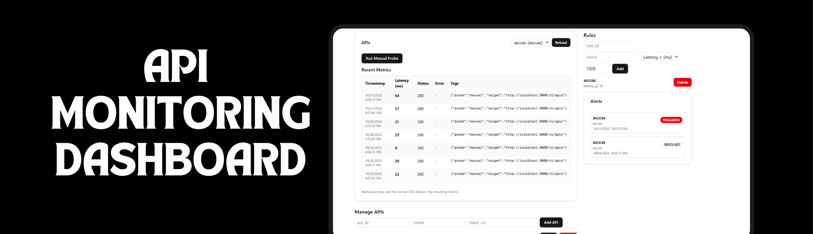

<p align="center">
  
</p>

# 📊 API Monitoring Dashboard

A **production-grade, real-time API monitoring system** built with Next.js, Node.js, and MongoDB. This dashboard is designed to stream live metrics and alerts with high resilience, testing discipline, and architectural scalability.


---

## 🚀 Why This Project Stands Out

Unlike basic CRUD applications, this system focuses on **real-time data integrity** and **fault tolerance**:

* **Real-Time Streaming:** Uses **Server-Sent Events (SSE)** for efficient, low-overhead data delivery.
* **Graceful Degradation:** Features an automatic **fallback to polling** if SSE connections fail, ensuring zero data gaps.
* **Resilience:** Implements automatic reconnect logic with **exponential backoff**.
* **Testing Discipline:** Comprehensive coverage including **Unit**, **Integration**, and **E2E (Playwright)** tests.
* **Agile Methodology:** Developed in iterative sprints with a focus on CI/CD and production-readiness.

---

## 🛠 Tech Stack

### Frontend
* **Framework:** Next.js 14+ (App Router)
* **Styling:** Tailwind CSS & shadcn/ui
* **State & Notifications:** React Context API & Sonner (Toasts)

### Backend
* **Runtime:** Node.js & Express.js
* **Database:** MongoDB (via Mongoose)
* **Streaming:** Server-Sent Events (SSE)

### DevOps & Testing
* **Unit Testing:** Jest & React Testing Library
* **E2E Testing:** Playwright
* **CI/CD:** GitHub Actions
* **Containerization:** Docker

---

## 📈 System Architecture & Flow

The system is built to handle the lifecycle of an API request from probe to visualization:

1.  **Management:** Users define APIs and Alert Rules (e.g., "Alert if latency > 500ms").
2.  **Streaming:** The backend pushes updates via an SSE stream.
3.  **Resilience Logic:** * The Frontend attempts an SSE connection.
    * If the connection drops, it attempts to reconnect.
    * If reconnection fails after $X$ attempts, it switches to **HTTP Polling** automatically.


---

## 📋 Core Features

| Feature | Description |
| :--- | :--- |
| **Live Metrics** | Monitor latency, status codes, and uptime in real-time. |
| **Smart Alerting** | Define custom rules for latency thresholds and error conditions. |
| **Resilient UI** | Visual indicators for "Live" vs "Degraded (Polling)" connection states. |
| **API Management** | Full CRUD interface for managing monitored endpoints. |
| **Automated CI** | Every push is validated through a suite of automated tests. |

---

## 🧪 Testing Strategy

The project maintains a high bar for code quality through a multi-tiered testing approach:

* **Unit Tests:** Validating frontend hooks and backend service logic.
* **E2E Tests (Playwright):** Simulating real user flows, including:
    * Dashboard loading and stream verification.
    * Manual probe triggering to verify real-time UI updates.
    * Simulating SSE failures to test fallback mechanisms.

---

## Screenshots


---

## ⚙️ Installation & Setup

### Prerequisites
* Node.js 18+
* MongoDB (Local or Atlas)

### 1. Clone the Repository
```bash
git clone [https://github.com/yourusername/api-monitoring-dashboard.git](https://github.com/yourusername/api-monitoring-dashboard.git)
cd api-monitoring-dashboard
```

## Backend Setup

```bash
cd backend
npm install

# Create a .env file with the following values
MONGODB_URI=your_mongodb_uri
PORT=3000

npm run dev

```

## Frontend Setup

```bash
cd frontend
npm install

# Create a .env.local file with the following value
NEXT_PUBLIC_API_BASE=http://localhost:3000

npm run dev

```

## Future Enhancements

- [ ] **Authentication** – Integration of Auth.js (NextAuth) for protected routes.
- [ ] **Data Visualization** – Historical metrics and trend analysis using Recharts.
- [ ] **Advanced Alerting** – Slack and Discord webhook integrations.
- [ ] **Dark Mode** – Native light/dark theme switching.


