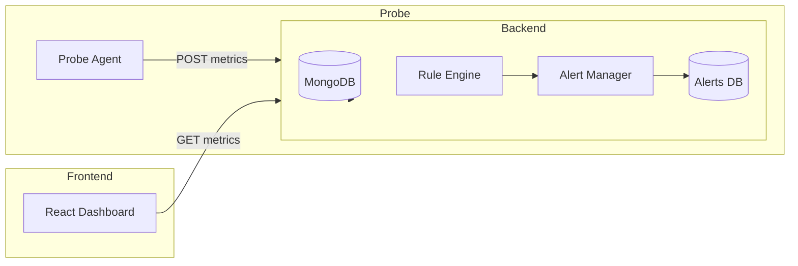

# Intelligent API Performance Monitoring System

A real-time API monitoring platform that tracks uptime, latency, and errors for registered APIs. Includes a probe agent, metrics ingestion backend, rule-based alerting engine, and DevOps-ready deployment with Docker and CI/CD.

---

## Table of Contents

- [Overview](#overview)  
- [Features](#features)  
- [System Architecture](#system-architecture)  
- [Tech Stack](#tech-stack)  
- [Project Structure](#project-structure)  
- [Prerequisites](#prerequisites)  
- [Setup and Running Locally](#setup-and-running-locally)  
- [Docker Deployment](#docker-deployment)  
- [API Endpoints](#api-endpoints)  
- [Testing and CI](#testing-and-ci)  
- [Future Improvements](#future-improvements)  
- [Author](#author)  
- [License](#license)

---

## Overview

Modern applications rely on APIs for authentication, payments, order processing, and third-party integrations. Failures or increased latency in these APIs can cause significant business disruption.

This project provides a monitoring platform that:

- Continuously probes registered APIs and measures latency and status codes,
- Stores metrics in MongoDB,
- Evaluates metrics against rules to detect anomalies,
- Emits alerts when performance degrades.

It is designed as an educational but production-minded system for learning full-stack and DevOps practices.

---

## Features

- API registration and metadata management  
- Probe agent for periodic checks and metric reporting  
- Metrics ingestion service with persistence (MongoDB)  
- Rule evaluation engine (prototype) and alert manager (skeleton)  
- Healthcheck endpoint for container orchestration and monitoring  
- Dockerized backend and MongoDB for reproducible deployments  
- Automated tests (Jest + Supertest) with in-memory MongoDB for CI

---

## System Architecture

The simplified architecture is:



---

## Tech Stack

**Backend**
- Node.js + Express
- TypeScript
- MongoDB + Mongoose
- Joi (validation)
- Pino (logging)

**Probe**
- Node.js + Axios

**Frontend (planned)**
- React + TailwindCSS or Material-UI
- Axios for API calls

**DevOps & Testing**
- Docker & Docker Compose
- GitHub Actions (CI)
- Jest + Supertest
- mongodb-memory-server (test DB)

---

## Project Structure

```
api-monitoring/
│
├── backend/
│   ├── src/
│   │   ├── models/
│   │   ├── routes/
│   │   ├── services/
│   │   ├── middlewares/
│   │   └── index.ts
│   ├── package.json
│   ├── Dockerfile
│   └── jest.config.ts
│
├── probe/
│   └── probe.js
│
├── frontend/
│   ├── src/
│   └── package.json
│
├── docker-compose.yml
├── .github/workflows/ci.yml
└── README.md
```

---

## Prerequisites

- Node.js 18 or later  
- npm  
- Docker & Docker Compose (for containerized run)  
- Git

---

## Setup and Running Locally

1. Clone repository:
```bash
git clone https://github.com/<your-username>/Api-Monitoring.git
cd Api-Monitoring
```

2. Backend (development):
```bash
cd backend
npm install
npm run dev
```
The backend server will be available at: `http://localhost:3000`

3. Frontend (optional, if implemented):
```bash
cd ../frontend
npm install
npm start
```
The frontend will be available at: `http://localhost:3001` (default)

4. Probe agent:
```bash
cd ../probe
node probe.js
```
By default the probe sends metrics to `http://localhost:3000/v1/metrics`. Adjust environment variables (TARGET, API_ID, INGEST_URL) as needed.

---

## Docker Deployment

From the repository root (where `docker-compose.yml` is located):

1. Build and start services:
```bash
docker-compose up --build
```

This command will build the backend image and start containers for backend and MongoDB.

2. Stop and remove containers:
```bash
docker-compose down
```

Notes:
- The Docker Compose setup maps backend port 3000 from the container to host port 3000.
- Docker healthcheck is recommended for the backend service to ensure automatic restarts on failures.

---

## API Endpoints

| Method | Endpoint | Description |
|--------|----------|-------------|
| POST   | `/v1/apis` | Register a new API |
| GET    | `/v1/apis` | List registered APIs |
| POST   | `/v1/metrics` | Ingest a metric from probe |
| GET    | `/v1/metrics?api_id=<id>&limit=<n>` | Retrieve metrics for an API |
| GET    | `/health` | Health check endpoint |

Example: register an API
```bash
curl -X POST http://localhost:3000/v1/apis   -H "Content-Type: application/json"   -d '{"api_id":"demo-api","name":"Demo API","base_url":"https://httpbin.org/delay/0","probe_interval":30,"expected_status":[200]}'
```

---

## Testing and CI

### Local tests
From the `backend` directory:
```bash
npm test
```

To run tests with coverage reporting:
```bash
npm test -- --coverage
```
This will generate a `coverage/` folder summarizing line/branch/function coverage.

### Continuous Integration
A GitHub Actions workflow is configured (`.github/workflows/ci.yml`) to run backend tests on push and pull requests. The CI job executes tests in the `backend` directory using Node 18 and reports failures on PRs.

---

## Future Improvements

Planned enhancements:
- Implement full rule engine with time windows and anomaly detection
- Slack and email alert integrations
- Grafana dashboards and Prometheus metrics exporter
- Frontend dashboard for visualizing metrics and alerts
- Kubernetes manifests and Helm charts for production deployment
- Role-based access control (OAuth2/JWT)

---

## Author

Dev Arora  
Software Engineering Student | Full Stack & DevOps Enthusiast

- GitHub: https://github.com/<your-username>  
- LinkedIn: https://linkedin.com/in/<your-handle>

Replace `<your-username>` and `<your-handle>` with your actual handles before publishing.

---

## License

This project is released under the MIT License. Feel free to use and modify for learning and research.
